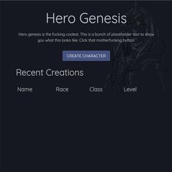
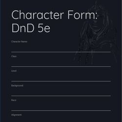
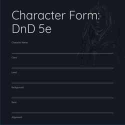

# Hero Genesis

## Description

### Deployment
* [Hero Genesis]
* [Hero Genesis GitHub page]

## Visuals

## Installations
### Requirements
* [Node.js]
* [MySQL Workbench]
* NPM Packages:
    * [dotenv]
    * [express]
    * [express handlebars]
    * [mysql2]
    * [phanthom-html-to-pdf]
    * [sequelize]

### Applications Used
* [Visual Studio Code]
* [Git Bash]
* [Chrome]

### Directory Stucture
All the recommended files and directories from the steps above should look like the following structure:

<!--  -->

### Setup
#### App Setup
1. Fork a copy to your GitHub repo and clone it to your computer.

1. Get to your Git Bash (or a command prompt service of your choosing) and get into the folder Hero-Genesis.

1. To get all the npm packages required to run the app - type into the command line `npm install` in the Hero-Genesis folder.

1. Create a server.js file.

#### Database Setup
1. On your computer, open MySQL Workbench (or a SQL service of your choosing) and login to a local server you have to set up.

1. Open a new SQL tab for executing queries.

1. Then go back to your Visual Studio Code (or a text editor of your choosing) and open your `Hero-Genesis` folder.

1. Inside the `Hero-Genesis` folder you will find a folder called `models`.

1. In the `models` folder, open the file call `schema.sql`.  Copy the code in the fole and paste it to the new SQL tab you opened in MySQL Workbench (or a SQL service of your choosing).

#### .env file Setup
1. In your Visual Studio Code (or a text editor of your choosing), open the file call `config.json` and type your password in placment of the `enter your MySQL password`.

1. Make sure you save the file before proceeding.

#### Open the app in browser
1. In the Git Bash (or a command prompt service of your choosing), go into the main folder of `Hero-Genesis`.

1. Type `node server.js` and hit enter.

1. Go to your browser and open a new tab and type `localhost: 3000` then hit enter.

### Using the app
* Main Page
* 

* Create Character
* 

* DND 5E
* 

* Fate Accerlerated
* 

## Technologies Used
* HTML
* CSS
* Node.js
* Express.js
* Handlebars
* Sequelize

## Contributing
Pull requests are welcome. For major changes, please open an issue first to discuss what you would like to change.

Please make sure to update tests as appropriate.

## Authors
### Meta
Aaron Rehlinger
* Contact info: 
* Portfolio: https://rehlingera.github.io
* GitHub: https://github.com/rehlingera

Jacob Franklin
* Contact info: 
* Portfolio: https://jacobtfranklin.github.io/Bootstrap-Portfolio/
* GitHub: https://github.com/JacobTFranklin

Sam Rehlinger
* Contact info:
* Portfolio: https://lamuel27.github.io/Updated-Portfolio/portfolio.html
* GitHub: https://github.com/Lamuel27

Paoge Moua
* Contact info: paoge.moua@gmail.com OR pobzeb.m@gmail.com
* Portfolio: https://paogemoua.github.io/
* GitHub: https://github.com/paogemoua

<!-- Linked -->
[MIT]: https://choosealicense.com/licenses/mit/
[Node.js]: https://nodejs.org/en/download/
[MySQL Workbench]: https://dev.mysql.com/downloads/workbench/
[dotenv]: https://www.npmjs.com/package/dotenv
[express]: https://www.npmjs.com/package/express
[express handlebars]: https://www.npmjs.com/package/express-handlebars
[mysql2]: https://www.npmjs.com/package/mysql2
[phanthom-html-to-pdf]: https://www.npmjs.com/package/phantom-html-to-pdf
[sequelize]: https://www.npmjs.com/package/sequelize
[Visual Studio Code]: https://code.visualstudio.com/download
[Git Bash]: https://git-scm.com/downloads
[Chrome]: https://www.google.com/chrome/
[Hero Genesis]: https://lit-reaches-81284.herokuapp.com/
[Hero Genesis GitHub page]: https://github.com/Lamuel27/Hero-Genesis